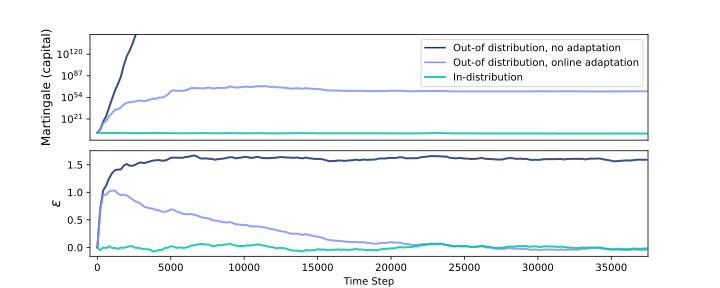
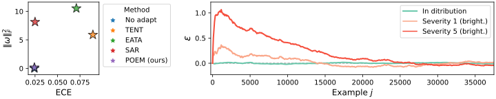
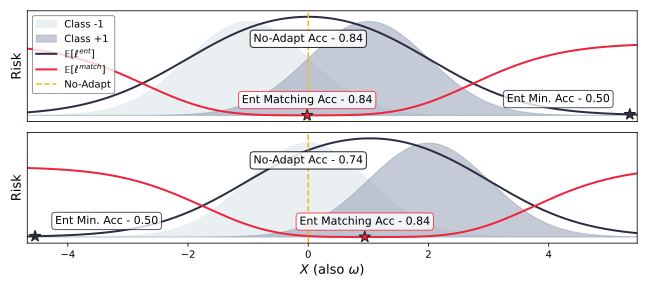

# Protected Online Entropy Matching (POEM) 🎼🎵🎶

Protected Online Entropy Matching (`POEM`) is a framework designed to enhance test-time domain adaptation via online self-training. The method dynamically updates model parameters based on distribution shifts in the test data entropy, improving robustness and maintaining accuracy.

## Table of Contents
- [Introduction](#introduction)
- [Key Components](#key-components)
- [Installation](#installation)
- [Usage](#usage)
- [Results](#results)
- [File Overview](#file-overview)
- [Relevant Sections in the Paper](#relevant-sections-in-the-paper)

## Introduction

POEM introduces a statistically principled approach to detect and adapt to distribution shifts in real-time. The framework consists of two main components:

1. A statistical framework that monitors and detects distribution shifts in classifier entropy values on a stream of unlabeled samples.
2. An online adaptation mechanism that dynamically updates the classifier's parameters based on detected distribution shifts.

The method leverages betting martingales and online learning to quickly react to distribution shifts, driving the distribution of test entropy values to match those from the source domain. This approach ensures improved test-time accuracy under distribution shifts while maintaining accuracy and calibration when no shifts are present.



## Key Components

1. **Entropy Drift Detection**: POEM uses a sequential test based on betting martingales to monitor and detect shifts in the distribution of classifier entropy values.

2. **Online Adaptation**: The framework employs an adaptive mechanism that updates model parameters to match the distribution of test entropy values with those of the source domain.

3. **Entropy Matching Loss**: A novel loss function is introduced to guide the self-training process, encouraging distributional alignment between source and target entropies.



## Installation

To install the POEM repository, follow these steps:

```bash
git clone https://github.com/yarinbar/poem.git
cd poem
conda create --name poem python=3.10
conda activate poem
pip install -r requirements.txt
```

### Note on ImageNet V2

Due to an [issue with ImageNet V2](https://github.com/modestyachts/ImageNetV2/issues/10) not loading labels correctly, we have created a replacement for the `torchvision.datasets.folder` file. To use this replacement:

```bash
cp datasets/folder.py /path/to/torchvision/datasets/folder.py
```
Replace `/path/to/torchvision/` with the actual path where your torchvision package is installed.

## Usage

To run an example using the POEM framework:

```bash
python main.py --method {poem, tent, sar, eata, cotta, no_adapt} --model {vitbase_timm, resnet50_gn_timm} --exp_type {bs1, continual, in_dist, natural_shift, severity_shift} --test_batch_size 1
```




## Results

POEM demonstrates superior performance across various test-time adaptation scenarios. Here's a summary of results on ImageNet-C, averaged over all 15 corruptions of severity 5:

| Method      | ResNet50 (GN) | ViT (LN) |
|-------------|---------------|----------|
| No adapt    | 31.44         | 51.65    |
| TENT        | 25.46         | 62.21    |
| EATA        | 38.63         | 64.14    |
| SAR         | 35.74         | 64.03    |
| POEM (ours) | 38.97         | 67.36    |

For detailed results on specific corruption types, please refer to the full paper.

## File Overview

- `cdf.py`: Implements the empirical Cumulative Distribution Function (CDF) for estimating entropy value distributions.
- `protector.py`: Implements the protection algorithm using test martingales and SF-OGD, corresponding to Algorithm 1 in the paper.
- `poem.py`: Core test-time adaptation model that utilizes components from `cdf.py` and `protector.py` for online entropy matching.

## Relevant Sections in the Paper

- **Section 3.3: Online Drift Detection**: Explains the statistical framework for detecting distribution shifts using entropy values.
- **Section 3.4: Online Model Adaptation**: Describes the online adaptation mechanism using the SF-OGD method.
- **Algorithm 1**: Detailed description of the protection algorithm implemented in `protector.py`.

For any questions or issues, please feel free to open an issue on GitHub or contact the authors.
